<p align="center">
  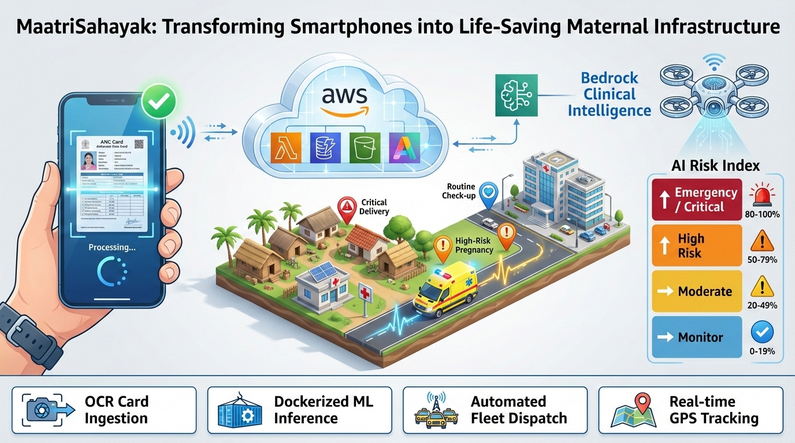
</p>

<h1 align="center">MaatriSahayak</h1>

<p align="center">
  <strong>AI-Powered Maternal Emergency Response Platform for Rural India</strong>
</p>

<p align="center">
  <a href="#features">Features</a> &bull;
  <a href="#architecture">Architecture</a> &bull;
  <a href="#getting-started">Getting Started</a> &bull;
  <a href="#project-structure">Project Structure</a> &bull;
  <a href="#ai--machine-learning">AI / ML</a> &bull;
  <a href="#api-reference">API Reference</a> &bull;
  <a href="#deployment">Deployment</a> &bull;
  <a href="#contributing">Contributing</a> &bull;
  <a href="#license">License</a>
</p>

<p align="center">
  
  
  
  
  
  
  
</p>

---

## The Problem

In rural India, maternal healthcare faces a devastating crisis that claims thousands of preventable lives every year.

<p align="center">
  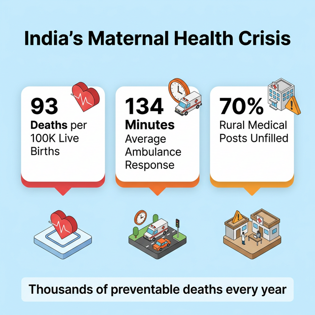
</p>

| Statistic | Value |
|:---|:---|
| Maternal deaths per 100,000 live births (rural) | **93** |
| Average ambulance response time | **134 minutes** |
| Rural medical positions unfilled | **70%+** |
| Preventable maternal deaths per year | **Thousands** |

The root cause follows the well-documented **Three Delays Model**: families delay seeking care, transportation is uncoordinated and slow, and hospitals receive patients unprepared.

<p align="center">
  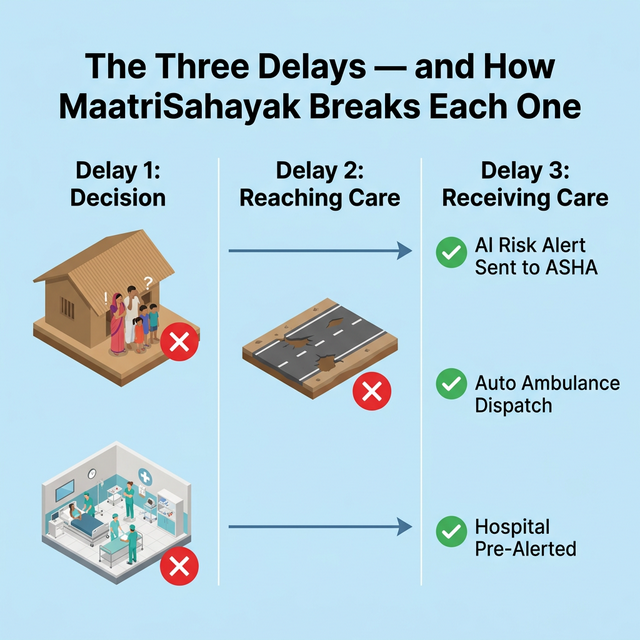
</p>

MaatriSahayak is built to break every single one of these delays.

---

## The Solution

MaatriSahayak is an end-to-end platform that combines **AI-driven risk prediction**, **real-time ambulance tracking**, **automated hospital coordination**, and an **offline-first mobile app** purpose-built for ASHA (Accredited Social Health Activist) workers in rural India.

### Key Capabilities

- **AI Risk Assessment** — A Random Forest ML model continuously monitors 11 clinical indicators and flags high-risk pregnancies before complications become critical.
- **One-Tap Emergency** — ASHA workers trigger a single button that automatically dispatches the nearest ambulance, reserves a hospital bed, and alerts all stakeholders.
- **Real-Time Tracking** — GPS-tracked ambulances with live ETA updates for families, health workers, and hospitals via IoT Core and AppSync.
- **Offline-First Mobile App** — Functions without internet using SQLite. Data syncs automatically when connectivity is restored; SMS fallback for critical alerts.
- **Intelligent Hospital Matching** — For critical cases, the system prioritizes hospitals with NICU beds and pre-sends patient records before arrival.
- **OCR Document Digitization** — Amazon Textract extracts data from handwritten ANC (Antenatal Care) cards via camera capture.
- **Hindi NLP** — Amazon Bedrock (Claude 3 Haiku) processes symptom descriptions in Hindi and maps them to medical conditions.

---

## Features

### For ASHA Workers (Mobile App)
| Feature | Description |
|:---|:---|
| Pregnancy Registration | Register and track pregnancies with AI-extracted ANC card data |
| Vitals Recording | Enter BP, weight, heart rate, blood sugar via touch or voice |
| Risk Dashboard | View AI-computed risk scores with actionable recommendations |
| Emergency Trigger | One-tap emergency that orchestrates the full response chain |
| Offline Mode | Full functionality without internet; auto-sync on reconnect |

### For District Health Officers (Web Dashboard)
| Feature | Description |
|:---|:---|
| Live Map | Real-time ambulance positions and high-risk pregnancy locations |
| Emergency Alerts | Live feed of active emergencies with status tracking |
| Analytics | Response time trends, outcome tracking, resource utilization |
| Pregnancy Management | Filter, search, and drill into individual pregnancy records |
| Report Export | Generate district-level reports for government stakeholders |

---

## Emergency Response — How It Works

When an emergency is triggered, the entire response chain completes in minutes, not hours.

<p align="center">
  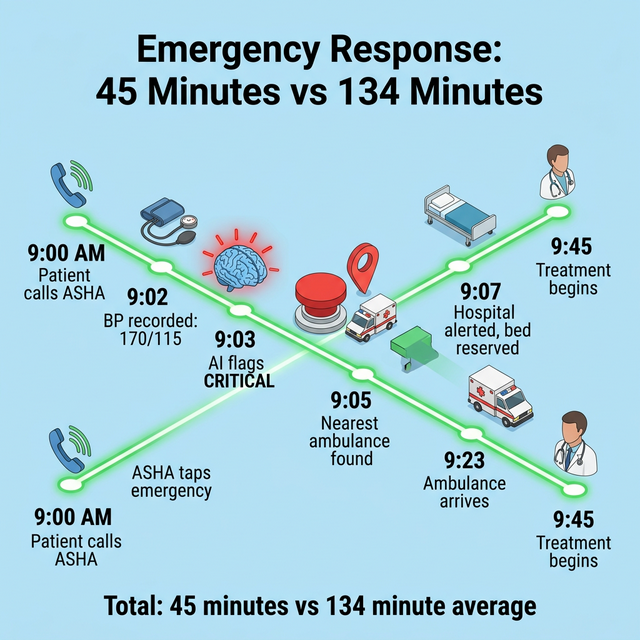
</p>

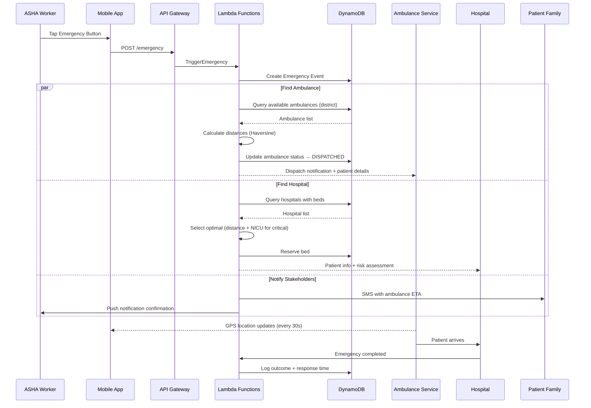

**Result**: Average response time drops from **134 minutes to under 30 minutes**.

---

## Architecture

<p align="center">
  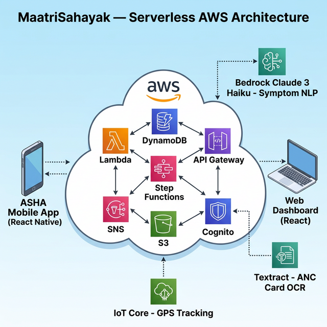
</p>

MaatriSahayak uses a fully serverless AWS architecture designed for cost-efficiency, automatic scaling, and rural-compatible low-bandwidth operation.

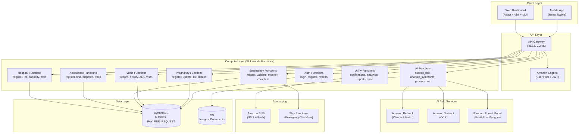

### AWS Services Used

| Service | Purpose | Status |
|:---|:---|:---|
| **Lambda** (Python 3.12) | 35 serverless functions, 512 MB memory, 30s timeout | ✅ Deployed |
| **API Gateway** | REST API with CORS, multi-environment (dev/staging/prod) | ✅ Live |
| **DynamoDB** | 6 tables with GSIs, Streams, Point-in-Time Recovery | ✅ Active |
| **Cognito** | User authentication with custom attributes (role, district) | ✅ Configured |
| **S3** | Storage for ANC card images and documents | ✅ Active |
| **SNS** | SMS and push notifications for emergency alerts | ✅ Configured |
| **SES** | Email notifications (welcome, approval, alerts) | ✅ Configured (sandbox) |
| **Textract** | OCR for handwritten ANC card digitization | ✅ Integrated |
| **Bedrock** | Claude 3 Haiku for Hindi symptom NLP | 🚧 In Progress |
| **Step Functions** | Emergency workflow orchestration (ASL state machine) | 🚧 Planned |
| **IoT Core** | MQTT-based real-time GPS tracking for ambulances | 🚧 Planned |
| **SAM / CloudFormation** | Infrastructure as Code, parameterized deployment | ✅ Deployed |

### Database Schema

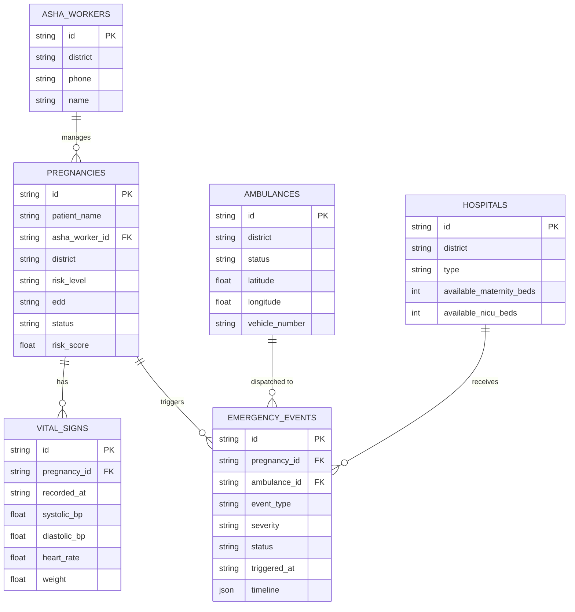

---

## AI / Machine Learning

<p align="center">
  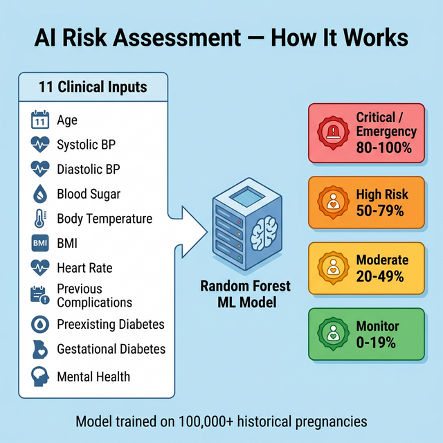
</p>

### Risk Prediction Model

The core ML model is a **Random Forest classifier** trained on historical maternal health data. It is served as a **FastAPI** application wrapped with **Mangum** for Lambda compatibility.

**Input Features (11):**

| Feature | Description | Type |
|:---|:---|:---|
| Age | Patient age in years | Continuous |
| Systolic BP | Systolic blood pressure (mmHg) | Continuous |
| Diastolic | Diastolic blood pressure (mmHg) | Continuous |
| BS | Blood sugar (mmol/L) | Continuous |
| Body Temp | Body temperature (Fahrenheit) | Continuous |
| BMI | Body mass index | Continuous |
| Heart Rate | Heart rate (bpm) | Continuous |
| Previous Complications | History of complications | Binary (0/1) |
| Preexisting Diabetes | Has diabetes | Binary (0/1) |
| Gestational Diabetes | Developed during pregnancy | Binary (0/1) |
| Mental Health | Mental health concerns | Binary (0/1) |

**Output:**

| Risk Level | Score Range | Action |
|:---|:---|:---|
| Low (Monitor) | 0 - 19% | Routine monitoring |
| Moderate | 20 - 49% | Increased surveillance |
| High | 50 - 79% | Weekly check-ins, prepare for complications |
| Critical / Emergency | 80 - 100% | Immediate intervention required |

### Bedrock Integration (NLP)

Amazon Bedrock with Claude 3 Haiku processes symptom descriptions in Hindi, translates them, maps to clinical conditions, and assesses severity. Example:

```
Input:  "पेट में बहुत दर्द है, उल्टी हो रही है, सिर चकरा रहा है"
        (Severe stomach pain, vomiting, dizziness)

Output: {
  "symptoms": ["severe_abdominal_pain", "vomiting", "dizziness"],
  "possible_conditions": ["preeclampsia", "placental_abruption"],
  "severity": "HIGH",
  "recommended_action": "EMERGENCY_REFERRAL"
}
```

### Textract for ANC Cards

ASHA workers photograph handwritten ANC cards. Textract extracts patient name, LMP, blood group, BP history, hemoglobin levels, and vaccination records. Low-confidence extractions (<85%) are flagged for manual review.

---

## Project Structure

```
MaatriSahayak/
├── infrastructure/                    # AWS SAM / CloudFormation
│   ├── template.yaml                  # 1,423 lines — full stack definition
│   ├── samconfig.toml                 # SAM deployment config
│   └── deploy.sh                      # Deployment script
│
├── lambda_functions/                  # Backend (Python 3.12)
│   ├── shared/                        # Lambda Layer — shared across all functions
│   │   ├── __init__.py                # Package exports
│   │   ├── constants.py               # Table names, risk levels, thresholds
│   │   ├── db_helper.py               # DynamoDB CRUD wrappers
│   │   ├── exceptions.py              # Custom exception hierarchy
│   │   ├── models.py                  # Pydantic v2 data models
│   │   ├── utils.py                   # HTTP responses, logging, Haversine
│   │   ├── validators.py              # Input validation functions
│   │   └── email_service.py           # SES email sending service
│   ├── register_pregnancy/            # POST /pregnancies
│   ├── record_vitals/                 # POST /vitals
│   ├── trigger_emergency/             # POST /emergency (core function)
│   ├── assess_risk/                   # POST /risk/assess/{id} (ML model)
│   ├── analyze_symptoms/              # Bedrock NLP for Hindi symptoms
│   ├── process_anc_card/              # Textract OCR pipeline
│   ├── find_nearest_ambulance/        # POST /ambulances/nearest
│   ├── send_notifications/            # SNS SMS + push notifications
│   ├── send_welcome_email/            # SES welcome email on registration
│   ├── list_emergencies/              # GET /emergencies with filters
│   └── ... (35 functions total)
│
├── frontend/                          # Web Dashboard
│   ├── src/
│   │   ├── pages/                     # Dashboard, Pregnancies, Emergency, Analytics, etc.
│   │   ├── components/                # Header, Sidebar, ProtectedRoute, ErrorBoundary, etc.
│   │   ├── services/                  # API client layer
│   │   ├── hooks/                     # useAuth, custom React hooks
│   │   ├── types/                     # TypeScript type definitions
│   │   └── utils/                     # Helper utilities
│   ├── package.json                   # React 18, MUI 5, TanStack Query 5, Recharts, Leaflet
│   └── vite.config.ts                 # Vite configuration with path aliases
│
├── MaatriSahayakMobile/               # Mobile App (React Native)
│   ├── src/
│   │   ├── screens/                   # Login, Home, Register, Vitals, Emergency
│   │   ├── components/                # Reusable UI components
│   │   ├── services/                  # API + offline sync services
│   │   ├── store/                     # Redux Toolkit state management
│   │   ├── navigation/                # React Navigation stack
│   │   └── config/                    # Environment configuration
│   └── android/ & ios/                # Native build folders
│
├── Maatrisahyak_ml/                   # ML Pipeline
│   ├── main.py                        # Standalone FastAPI server
│   ├── maatrisahyak.pkl               # Trained Random Forest model (~667 KB)
│   ├── notebook_script.py             # Model training script
│   ├── retrain.py                     # Re-training utility
│   └── test_model.py                  # Model testing script
│
├── database/                          # DynamoDB schema definitions (JSON)
├── step_functions/                    # Step Functions ASL state machine
│   └── emergency_workflow.asl.json    # Emergency orchestration workflow
├── tests/                             # Unit and integration tests
│   ├── unit/                          # 5 unit test files
│   ├── integration/                   # 2 integration test files
│   └── fixtures/                      # Test data fixtures
├── scripts/                           # Deployment and utility scripts
├── .github/
│   ├── workflows/
│   │   ├── deploy.yml                 # CI/CD deployment pipeline
│   │   ├── test.yml                   # Automated testing pipeline
│   │   ├── seed-data.yml              # Seed DynamoDB with sample data
│   │   └── cleanup.yml                # Resource cleanup workflow
│   └── dependabot.yml                 # Automated dependency updates
│
├── DESIGN.md                          # Technical architecture document
├── REQUIREMENTS.md                    # Functional and non-functional requirements
├── PROJECT_OVERVIEW.md                # Stakeholder overview
├── IMPLEMENTATION_ROADMAP.md          # Phased roadmap
└── WINNING_STRATEGY.md                # Hackathon strategy
```

---

## Live Demo

🌐 **Website**: [http://maatrisahayak.in](http://maatrisahayak.in) (LIVE)

The web dashboard is deployed and accessible. You can register as a District Health Officer and explore the platform.

---

## Getting Started

### Prerequisites

| Requirement | Version |
|:---|:---|
| Python | 3.12+ |
| Node.js | 18+ |
| AWS CLI | 2.x |
| AWS SAM CLI | 1.x |
| React Native CLI | Latest |
| Android Studio | Latest (for mobile development) |

### 1. Clone the Repository

```bash
git clone https://github.com/Krishna-Tripathi78/MaatriSahayak.git
cd MaatriSahayak
```

### 2. Configure Environment

```bash
cp .env.example .env
```

Edit `.env` with your AWS credentials:

```env
AWS_ACCESS_KEY_ID=your-access-key-id
AWS_SECRET_ACCESS_KEY=your-secret-access-key
AWS_DEFAULT_REGION=us-east-1
DYNAMODB_TABLE_PREFIX=maatrisahayak
```

### 3. Deploy Backend (AWS SAM)

```bash
cd infrastructure
sam build
sam deploy --guided
```

SAM will prompt for the environment parameter (`dev`, `staging`, or `prod`) and deploy the full stack: API Gateway, Lambda functions, DynamoDB tables, Cognito, and SNS.

After deployment, seed the database with sample data:

```bash
cd scripts
python seed_data.py
```

### 4. Start the Web Dashboard

```bash
cd frontend
npm install
npm run dev
```

The dashboard runs at `http://localhost:5173` (Vite dev server).

### 5. Start the Mobile App

```bash
cd MaatriSahayakMobile
npm install
npx react-native run-android
```

### 6. Run the ML Service (Standalone)

```bash
cd Maatrisahyak_ml
pip install fastapi uvicorn pandas scikit-learn pydantic
uvicorn main:app --reload --port 8000
```

Test the prediction endpoint:

```bash
curl -X POST http://localhost:8000/predict \
  -H "Content-Type: application/json" \
  -d '{
    "Age": 28,
    "Systolic_BP": 165,
    "Diastolic": 110,
    "BS": 8.5,
    "Body_Temp": 100.2,
    "BMI": 29.5,
    "Previous_Complications": 1,
    "Preexisting_Diabetes": 0,
    "Gestational_Diabetes": 1,
    "Mental_Health": 0,
    "Heart_Rate": 92
  }'
```

---

## API Reference

All endpoints are served via API Gateway at:
```
https://{api-id}.execute-api.{region}.amazonaws.com/{environment}/
```

### Authentication

| Method | Endpoint | Description | Status |
|:---|:---|:---|:---|
| POST | `/asha/register` | Register a new ASHA worker | ✅ |
| POST | `/asha/login` | Login and receive JWT tokens | ✅ |
| POST | `/auth/refresh` | Refresh authentication tokens | ✅ |
| GET | `/asha/{id}` | Get ASHA worker profile | ✅ |
| PUT | `/asha/{id}` | Update ASHA worker profile | ✅ |
| POST | `/officer/register` | Register a District Health Officer | ✅ |
| POST | `/driver/register` | Register an ambulance driver | ✅ |

### Pregnancy Management

| Method | Endpoint | Description | Status |
|:---|:---|:---|:---|
| POST | `/pregnancies` | Register a new pregnancy | ✅ |
| GET | `/pregnancies` | List pregnancies (filterable, paginated) | ✅ |
| GET | `/pregnancies/{id}` | Get pregnancy details | ✅ |
| PUT | `/pregnancies/{id}` | Update pregnancy information | ✅ |

### Vitals and ANC

| Method | Endpoint | Description | Status |
|:---|:---|:---|:---|
| POST | `/vitals` | Record vital signs | ✅ |
| GET | `/pregnancies/{id}/vitals-history` | Get vitals timeline | ✅ |
| POST | `/anc/visits` | Record an ANC visit | ✅ |
| GET | `/pregnancies/{id}/anc-history` | Get ANC visit history | ✅ |

### Emergency

| Method | Endpoint | Description | Status |
|:---|:---|:---|:---|
| POST | `/emergency` | Trigger emergency response | ✅ |
| GET | `/emergencies` | List all emergencies with filters | ✅ |
| GET | `/emergencies/{id}` | Monitor emergency status | ✅ |
| PUT | `/emergencies/{id}/complete` | Complete emergency | ✅ |

### Ambulance

| Method | Endpoint | Description | Status |
|:---|:---|:---|:---|
| POST | `/ambulances` | Register an ambulance | ✅ |
| POST | `/ambulances/nearest` | Find nearest available ambulance | ✅ |
| PUT | `/ambulances/{id}/location` | Update ambulance GPS location | ✅ |
| GET | `/ambulances/{id}/status` | Get ambulance status | ✅ |
| GET | `/ambulances/{id}/route` | Get ambulance route | 🚧 |

### Hospital

| Method | Endpoint | Description | Status |
|:---|:---|:---|:---|
| POST | `/hospitals` | Register a hospital | ✅ |
| GET | `/hospitals` | List hospitals | ✅ |
| GET | `/hospitals/{id}/capacity` | Check hospital bed capacity | ✅ |
| PUT | `/hospitals/{id}/capacity` | Update hospital capacity | ✅ |

### AI / ML

| Method | Endpoint | Description | Status |
|:---|:---|:---|:---|
| POST | `/risk/assess/{pregnancy_id}` | Run ML risk assessment | ✅ |
| POST | `/symptoms/analyze` | Analyze symptoms via Bedrock NLP | 🚧 |
| POST | `/anc/process` | Process ANC card image via Textract | ✅ |

---

## Testing

### Backend (Python)

```bash
cd tests
python -m pytest unit/ -v
python -m pytest integration/ -v
```

### Frontend (Vitest)

```bash
cd frontend
npm run test              # Run tests
npm run test:ui           # Interactive UI
npm run test:coverage     # Coverage report
```

### CI/CD Pipelines

The project includes 4 GitHub Actions workflows:

| Workflow | Trigger | Description |
|:---|:---|:---|
| `test.yml` | Push / PR | Runs unit and integration tests |
| `deploy.yml` | Push to main | Deploys to AWS via SAM |
| `seed-data.yml` | Manual | Seeds DynamoDB with sample data |
| `cleanup.yml` | Manual | Tears down AWS resources |

---

## Current Implementation Status

**Overall Progress**: ~86% Complete

### ✅ Fully Implemented
- Backend Infrastructure (35 Lambda functions deployed)
- API Gateway with Cognito authentication
- DynamoDB database with 6 tables
- Web Dashboard (live at maatrisahayak.in)
- Mobile App (React Native - 85% complete)
- AI Risk Assessment (Random Forest model)
- ANC Card OCR (Amazon Textract)
- Email notifications via AWS SES
- Officer registration and approval workflow

### 🚧 In Progress
- AWS Bedrock integration for Hindi NLP (handler exists, needs wiring)
- Real-time WebSocket updates for dashboard
- Mobile app offline SQLite database
- Push notifications (FCM)
- IoT Core for real-time ambulance GPS tracking
- Step Functions parallel emergency orchestration

### 📋 Planned
- Production SES access (pending AWS approval)
- Full offline-first mobile architecture
- Multi-language support (Hindi UI)
- Advanced analytics and reporting
- End-to-end testing suite

For detailed progress tracking, see [PROGRESS_SUMMARY.md](PROGRESS_SUMMARY.md).

---

## Impact

<p align="center">
  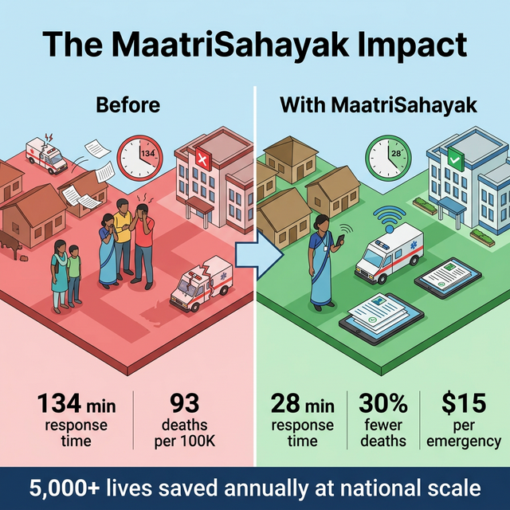
</p>

| Metric | Before | With MaatriSahayak |
|:---|:---|:---|
| Average ambulance response time | 134 minutes | **< 30 minutes** |
| Maternal deaths per 100K | 93 | **65** (30% reduction) |
| Emergency cost (AWS) | — | **$15 per emergency** |
| Monthly infrastructure cost (1,000 pregnancies) | — | **~$780/month** |
| Lives saved annually at national scale | — | **5,000+** |

---

## Deployment Environments

| Environment | Use Case | API Stage |
|:---|:---|:---|
| `dev` | Development and testing | `/dev` |
| `staging` | Pre-production validation | `/staging` |
| `prod` | Production deployment | `/prod` |

All resources are parameterized with the environment suffix (e.g., `maatrisahayak-pregnancies-dev`).

---

## Cost Analysis

| Service | Usage (1,000 pregnancies) | Monthly Cost |
|:---|:---|:---|
| Lambda | 5M invocations | $50 |
| DynamoDB | On-demand, 100 GB | $100 |
| S3 | 100 GB storage | $30 |
| Bedrock | 1M tokens (Claude Haiku) | $200 |
| IoT Core | 1M messages | $40 |
| API Gateway | 5M requests | $20 |
| SNS | 100K SMS | $50 |
| Textract | 5K pages | $75 |
| Location Service | 100K requests | $35 |
| CloudWatch | Logs + metrics | $30 |
| **Total** | | **~$780/month** |

MVP operates entirely within the **AWS Free Tier** during the first 12 months.

---

## Roadmap

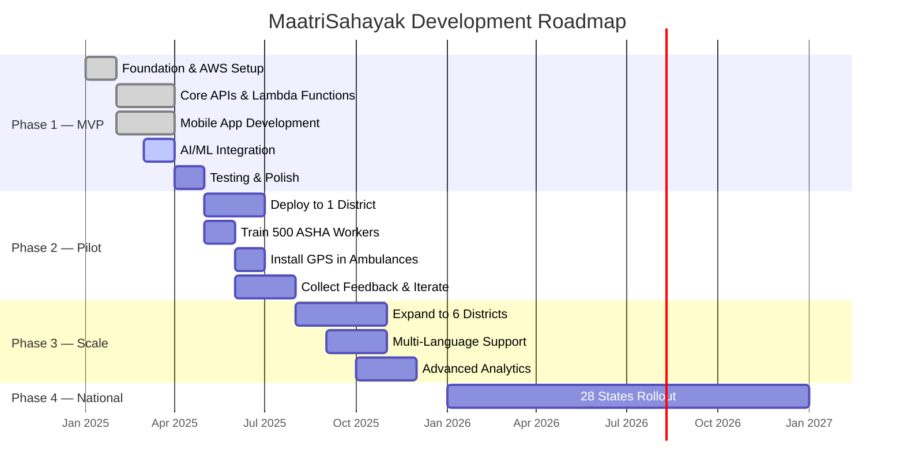

---

## Security and Compliance

- **Authentication**: Amazon Cognito with JWT tokens, password policies (8+ chars, mixed case, numbers)
- **Authorization**: Role-based access control (ASHA Worker, ANM, District Officer, Admin)
- **Encryption**: All data encrypted at rest (DynamoDB, S3) and in transit (TLS 1.2+)
- **Audit Logging**: CloudWatch Logs with Powertools structured logging
- **Data Recovery**: Point-in-Time Recovery (PITR) enabled on all DynamoDB tables
- **Dependency Security**: Dependabot automated vulnerability scanning
- **HIPAA-Equivalent**: AWS infrastructure compliant with Indian health data regulations

---

## Documentation

| Document | Description |
|:---|:---|
| [DESIGN.md](DESIGN.md) | Detailed technical architecture and design decisions |
| [REQUIREMENTS.md](REQUIREMENTS.md) | Functional and non-functional requirements |
| [PROJECT_OVERVIEW.md](PROJECT_OVERVIEW.md) | Stakeholder and hackathon overview |
| [IMPLEMENTATION_ROADMAP.md](IMPLEMENTATION_ROADMAP.md) | Phased implementation plan |
| [WINNING_STRATEGY.md](WINNING_STRATEGY.md) | Hackathon strategy and positioning |
| [PROGRESS_SUMMARY.md](PROGRESS_SUMMARY.md) | Current implementation status and remaining tasks |

---

## Quick Start Guide

### For District Health Officers (Web Dashboard)

1. Visit [http://maatrisahayak.in](http://maatrisahayak.in)
2. Click "Register as Officer"
3. Fill in your details (name, email, phone, district)
4. Wait for admin approval (email notification sent)
5. Login and access the dashboard

### For ASHA Workers (Mobile App)

1. Install the MaatriSahayak mobile app
2. Register with your ASHA ID and district
3. Wait for approval from District Health Officer
4. Set up your 4-digit PIN for quick access
5. Start registering pregnancies and recording vitals

### For Developers

See the [Getting Started](#getting-started) section above for local development setup.

---

## Contributing

1. Fork the repository
2. Create a feature branch (`git checkout -b feature/your-feature`)
3. Commit your changes (`git commit -m 'Add your feature'`)
4. Push to the branch (`git push origin feature/your-feature`)
5. Open a Pull Request

Please ensure all tests pass before submitting a PR:
```bash
cd tests && python -m pytest -v
cd frontend && npm run test
cd frontend && npm run lint
```

---

## Team

Built with purpose by the MaatriSahayak team for the AWS AI Hackathon.

---

## License

This project is licensed under the MIT License. See the [LICENSE](LICENSE) file for details.

---

<p align="center">
  <em>MaatriSahayak is more than a platform — it is a lifeline for millions of mothers.<br/>Technology with purpose. AI for good.</em>
</p>
